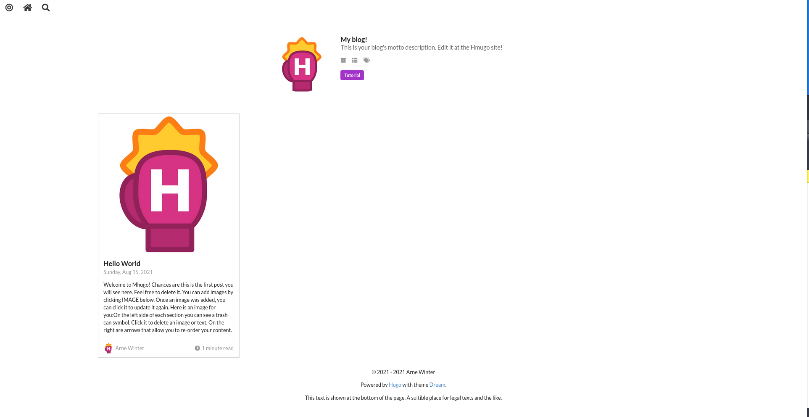
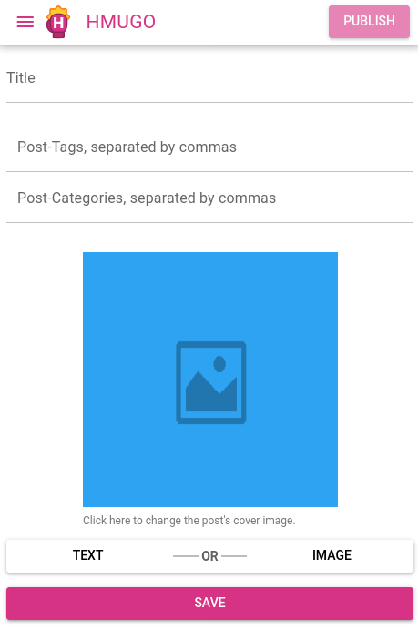
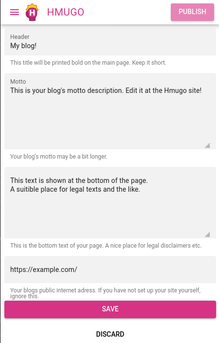
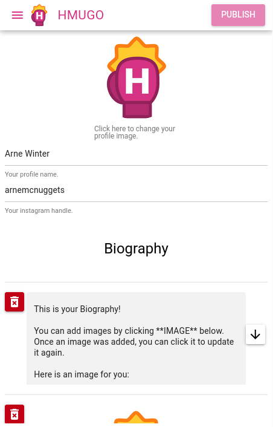

* [hmugo](#hmugo)
  * [Usage](#usage)
    * [Managing posts](#managing-posts)
    * [Managing other site data](#managing-other-site-data)
    * [Managing your profile](#managing-your-profile)
    * [Publishing](#publishing)
  * [Setup Guide](#setup-guide)
  * [Serving the site and hmugo](#serving-the-site-and-hmugo)

# hmugo


**Hmugo** (Hit Me Up, Hugo) is an easy-to-use blogging app for content
administration with [Hugo](https://gohugo.io)

The project was created to let non-technical users write statically generated blogs,
leveraging Hugo's simplicity, speed and flexibility.

While Hugo makes **building websites** fun again, Hmugo makes
**maintaining content** fun as well.

Hmugo has been tested and developed with the
[Dream](https://github.com/g1eny0ung/hugo-theme-dream)
theme by [g1eny0ung](https://github.com/g1eny0ung).

Using a different theme is certainly possible, but not yet implemented in this version.
If you have not set up your blog yourself and wish to change themes, please ask your
site administrator.

Hugo is distributed under the [Apache 2.0 License](https://github.com/gohugoio/hugo/blob/master/LICENSE)
No changes were made to the original source code.

## Usage

Think of Hmugo like a CMS to your hugo-powered blog.
Because I wrote it for my own needs, it might feel a tint opinionated. This project is definitely not a general-purpose Hugo-GUI.

There is CRUD on posts and some knobs and bolts for your blogs general texts and images.

For my private needs, i have developed hmugo against the Dream-Theme,
the out-of-the-box results will therefore look like this:



Most of the entries you see can be configured.

### Managing posts

Posts can be managed in the frontend by navigating to the corresponding menu item.
The existing posts will be listed, clicking on them will allow you to update them. 
Clicking the "New Post" Image will take you to the *Post Editor*:



Here you can set the post's title, tags, categories and of course the content.

### Managing other site data

You can adjust your site's title and subtitle, along with the footer text at the *Site Settings*.



### Managing your profile

You can change your blog author profile by clicking on *Profile*.
Here you can set your name and instagram handle, and also write a short bio.



### Publishing

Whenever changes were detected, the *Publish* Button at the top of the page will become clickable.
Clicking it will:

1. git commit & push your site
2. invoke `hugo` from your site's directory.

therefore re-rendering your blog.

Clicking *Discard* within the left-side menu instead will `git clean` your site's directory, effectively restoring a backup.

## Setup Guide

1. First you will have to clone this repository.

`git clone --recurse-submodules https://github.com/arnemileswinter/hmugo`

2. Then you will need to fork the [starter-boilerplate repository](https://github.com/arnemileswinter/hmugo-blog-starter) and clone the fork into some folder (e.g. my-blog), again including `--recurse-submodules` somewhere to your drive.

3. After having done this, create an ssh key pair with `ssh-keygen` to get `id_rsa` and `id_rsa.pub`.
Register the `id_rsa.pub` key with your GitHub or other git-platform, such as GitLab or Gogs/Gitea.

4. Edit the file `frontend/quasar.conf.js` and replace the variable `VUE_APP_API_URL: "http://localhost:8080"` to not point to `localhost:8080` but rather the URL where the backend is hosted. Also replace the variable `VUE_APP_API_KEY: "changeme"` with some opaque token that you will generate. For example [here](https://www.random.org/passwords/?num=1&len=16&format=html&rnd=new).

5. Also within the `frontend` directory, invoke `yarn` and `./node_modules/.bin/quasar build` to build the frontend.

6. Invoke 
```
docker run -d -p 8080:80 \ 
        -e API_KEY=<the random key you built the frontend with>
        -v $PWD/my-blog:/site \
        -v $PWD/id_rsa:/root/.ssh/id_rsa \
        -v $PWD/id_rsa.pub:/root/.ssh/id_rsa.pub \
        arnemcnuggets/hmugo:latest
```
and make sure you have replaced the API_KEY with the correct value, as entered in the frontend.

7. Your site at my-blog/ can now be managed by hmugo.

## Serving the site and hmugo

You will need some webserver such as nginx or apache to serve your blogs public directory at `my-blog/public`.
You will also need a webserver to serve the hmugo frontend located in `frontend/dist/spa`.

**It is advised to secure the hmugo frontend at `frontend/dist/spa` with some authentication mechanism your webserver offers (in a simple scenario http-basic auth will suffice). Else your API-Key will be compromised and everyone can manage your blog.**